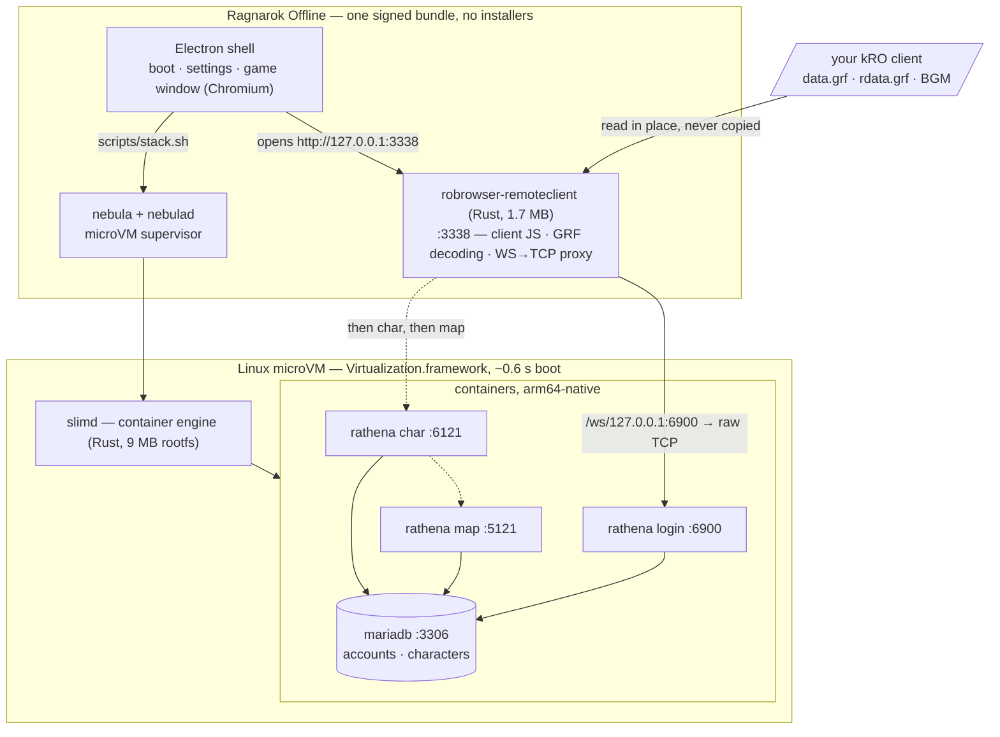
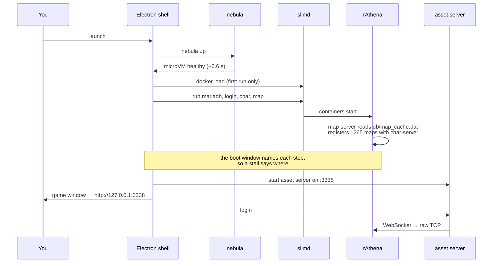
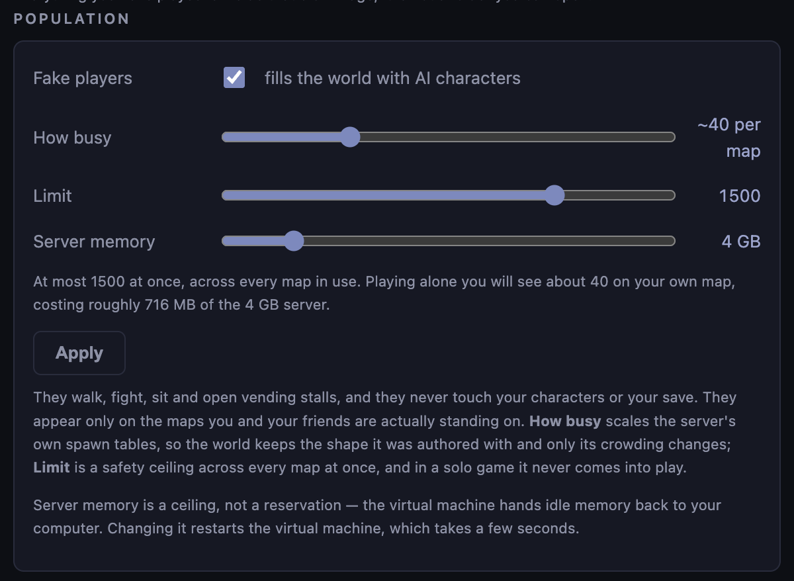

<p align="center">
  
</p>

# Ragnarok Offline

<sub>Icon generated with GPT Image 2. No Gravity assets used.</sub>

A single, self-contained app that runs **Ragnarok Online offline** — server, client,
and game window in one icon. Double-click it and you are in Midgard after obtaining
the assets. macOS, Linux and Windows.

**[Join the Discord](https://discord.gg/jUYC9dMbu5)** for help getting set up, or
read the [Troubleshooting](#troubleshooting) section below. Bugs and feature
requests are welcome as [issues](../../issues).

---

> [!IMPORTANT]
> **Two things to know on Windows.**
>
> **1. Windows may block the app from starting.** Our files are not code-signed
> yet, so on a newer Windows 11 install Smart App Control refuses to run them —
> from 1.0.2 the app says so directly, with the error *"An Application Control
> policy has blocked this file"*. If you hit it, read
> [this troubleshooting section](https://github.com/Flux159/ragnarokoffline.app/tree/main#windows-an-application-control-policy-has-blocked-this-file)
> before changing anything. Signing is in progress ([#8](../../issues/8)) and
> will need nothing from you.
>
> **2. Close kernel-level anti-cheat before starting.** Riot Vanguard
> (Valorant, League of Legends) and similar always-on anti-cheat drivers load at
> boot and take exclusive control of the hypervisor. Running one alongside this
> app has put at least one machine into a **reboot loop**. Fully exit the game
> and its anti-cheat service — or reboot without it — before launching. Faceit,
> ESEA and EasyAntiCheat's kernel mode are likely to behave the same way.

## Getting started

**[Watch the setup walkthrough](https://youtu.be/1Ib_KqHDCLA)** — download,
assets, first launch — or follow the same three steps below.

**1. Download a build.** Grab the latest release for your platform from the
[releases page](../../releases).

**2. Get a Ragnarok client.** You supply your own — see [License](#license). Put it
somewhere you can find again; unzipping a full client gives you a folder containing
`data.grf`, `rdata.grf` and a `BGM` folder, which is what the app looks for.

It has to be a **renewal** client. The server runs renewal, and a pre-renewal
client will not work with it — pre-renewal support is [issue #3](../../issues/3).
That also means a client with no `rdata.grf` will not work: renewal maps, sprites
and effects live in that archive, and there is no way for the app to supply them.
**kRO '23 is the most tested** — if you have a choice, use that one.

If you only want to join a friend who is hosting a server, see
[Hosting and playing with friends on your LAN](#hosting-and-playing-with-friends-on-your-lan)
— you do not need the assets at all.

**3. Open the app and point it at that folder.** The setup screen has a folder
picker: choose the folder you unzipped and it finds the rest. Then it starts the
server and drops you at the login screen.

Log in with **`ragnarok`** / **`ragnarok`** — the account is created for you on
first run — and make a character.

First launch takes a few minutes: it unpacks the runtime, boots the microVM, loads
the container images and initialises the database. The window names each step as it
goes, so you can see where it is. Every launch after that is seconds.

**4. Optional: fill the world with people.** A private server is empty by
default. Settings → **Population** puts AI characters on the map with you —
hunting in the fields, standing around town, running vending stalls you can
actually buy from. See [Filling the world](#filling-the-world) below.

---

## Hosting and playing with friends on your LAN

Everyone on the same wifi can play together on one person's machine. Only the
host needs the game files.

**[Watch two machines play together](https://youtu.be/-7QMhD4R97k)** — hosting
on one, joining from another.

### If you are hosting

**1. Go to Settings, tick "Let other machines connect", and restart the server.**
The engine reads this when it starts, so the *Restart server* button is what
applies it. Off by default, the server listens only on your own machine.


**2. Copy the link next to *Your link* and send it to your friends.** One link
covers both ways of joining — pasted into the app, or opened in a browser — and
it only works for people who can already reach your computer on the network. The
first time you turn this on, your machine will likely ask you to approve local
network access — say yes, or nobody can connect.

**3. Keep the app running.** You are the server: when you quit, everyone's session
ends. Characters live on your machine too, so they stay with you rather than with
their owners.

### If you are joining

Joining a friend's server does not require you to download assets. On the setup
screen, just click **Join a friend** and paste the link that your friend sent.


The host serves the client and the artwork, so joining starts in seconds instead
of the few minutes a first run takes. You make your own character on their
server: on the login screen, add `_M` or `_F` to the end of a new username and
that account is created as you log in.

### Joining from a browser, with nothing installed

The client is roBrowserLegacy, and the host is already serving it over HTTP — so
the same link opens the game in a normal browser. **Paste it into the address
bar and play. No download, no app, no game files.**

```
http://192.168.1.20:3338/
```

That is the whole of it. The app is the more comfortable way to play — it is one
window with no browser chrome, and it does not ask "Leave site?" when you close
it — but nothing about the game needs it. Anything on the wifi with a browser
that does WebGL will do, which includes a Windows or Linux machine with no build
of this app on it. Chrome and Firefox are the tested ones.

The host still has to be hosting: the link is only live while their app is
running with *Let other machines connect* on.

### Switching between the two

The same app does both, and you can change your mind at any time. In Settings,
switch **Mode**:

<p>
  
  
</p>

Picking **Join a friend** asks for their address; **Play on my own server** takes
you back to hosting. Joining runs nothing locally — no server, no microVM — so
switching to it stops your stack, and switching back starts it again.

---

## Architecture

Under the hood it stitches together three existing projects:

| Piece | Project | Role |
|---|---|---|
| microVM orchestrator | [**nebula**](https://github.com/Flux159/nebula) | Runs the Linux side of the stack in a fast, embedded microVM |
| game server | [**rAthena**](https://github.com/rathena/rathena) | The open-source RO server emulator (login / char / map) + MariaDB |
| game client | [**roBrowserLegacy**](https://github.com/MrAntares/roBrowserLegacy) + [**RemoteClient**](https://github.com/Flux159/roBrowserLegacy-RemoteClient-Rust) | WebGL RO client, GRF asset server, and TCP↔WebSocket proxy |

The short version: **rAthena and roBrowserLegacy run inside Linux containers,
inside a microVM the app carries with it.** Nothing is ported. The hard
part of running an RO server on a Mac is not the server — it is that the server was
never meant to run on one. So we do not port it; we bring Linux. The same holds for
Windows, which is how one codebase covers three platforms.

roBrowserLegacy carries three small client patches in `patches/`. rAthena is
built from a clean upstream clone with one optional server modification compiled
in: the [Population Engine](https://github.com/YlenXWalker/Population-Engine),
which fills a solo world with AI characters and is **off unless you turn it on**
in Settings.

**We ship a modified copy of it.** It is GPL-3.0, like rAthena, and our changes
live in `third-party/population-engine/` — the engine's own sources with our
edits marked `RAGNAROKMAC`, plus patches for the files rAthena owns. We added a
master switch (upstream has none), made population follow the players rather
than filling all 124 maps at once, stopped the movement tick running for
characters nobody can see, made crowding a setting instead of a rebuild, and
took character levels from the monsters on each map. The spawn tables and gear
sets are edited too. That directory's README lists all of it, and the full
modified source is here in the repository as the licence requires.

The shell is **Electron**, so the same Chromium renders the client everywhere and
there is one renderer to test against rather than three.



Ports are published to `127.0.0.1` unless you turn on
[LAN hosting](#hosting-and-playing-with-friends-on-your-lan), which binds them to
your network interface instead. The GRFs stay wherever you keep them —
the app symlinks them into a server root and reads them where they lie, so a
3.5 GB client is never duplicated.

### What actually happens when you press play



### Why a microVM rather than a native build

rAthena officially targets Linux and Windows. macOS is not a supported platform
and Apple Silicon less so. Compiling it against Homebrew MariaDB works for some
people some of the time, which is precisely the fragility a shipped `.app`
cannot have.

So the server runs on the platform it is actually tested on, and we inherit
every upstream fix instead of maintaining a fork. The cost is a microVM, and
with nebula-slim that cost is small: a **9.4 MB** compressed guest rootfs
running `slimd` — a Rust container engine — rather than the ~130 MB of
dockerd + containerd + runc it replaces.

The same property is what makes this cross-platform. The Linux side does not
change between macOS, Windows and Linux; only the host-side VM integration does.

### What each piece is, and whose it is

| Piece | Origin | Role here |
|---|---|---|
| [rAthena](https://github.com/rathena/rathena) | upstream, GPL-3.0 | the server. Built arch-native at image build time from a clean clone, plus the optional population engine below |
| [Population Engine](https://github.com/YlenXWalker/Population-Engine) | upstream, GPL-3.0 | server-side AI characters, compiled in but off by default. Vendored in `third-party/`, see its README |
| [roBrowserLegacy](https://github.com/MrAntares/roBrowserLegacy) | upstream, GPL-3.0 | the client. Built from source with a few patches in `patches/` |
| [RemoteClient](https://github.com/Flux159/roBrowserLegacy-RemoteClient-Rust) | GPL-3.0 | Rust rewrite of roBrowserLegacy's Node asset server |

---

## Filling the world

A server of your own is a quiet place. Turn on **Fake players** in Settings and
the world gets inhabitants: they walk, fight monsters, sit around town, and open
real vending stalls you can buy from. They never touch your characters or your
save.

<p align="center">

</p>

**How busy** is the one to reach for. It scales how crowded each map feels — the
readout tells you roughly how many characters you will see around you, and the
line underneath estimates the memory that costs. Start at 100% and move it if a
town feels too sleepy or too packed.

**Limit** is a safety ceiling across every map at once, not a headcount. Playing
alone you will never reach it: characters only exist on the maps you and your
friends are actually standing on, so leaving a map hands its inhabitants back
rather than keeping thousands of them alive somewhere you cannot see. That is
also why the world does not cost anything while you are not playing.

**Server memory** is how much the virtual machine may use, and it defaults to a
quarter of your computer's memory, up to 4 GB. On macOS it is a ceiling rather
than a reservation — idle memory goes back to you. **On Windows and Linux the
virtual machine holds it for as long as the server runs**, so on an 8 GB machine
leave room for Windows and your browser. Changing it restarts the virtual
machine, which takes a few seconds.

Characters are levelled to the map they are on, taken from the monsters that
live there, so a starting field holds beginners in plain gear and a late-game
map does not. Applying any of this restarts the server, so log back in
afterwards.

If your machine gets hot, this is the setting to turn down: the AI characters
are the only part of the server that costs meaningful CPU. The game itself runs
on very little.

---

## English translation assets

kRO is Korean, and the translation comes from
[**ROenglishRE**](https://github.com/llchrisll/ROenglishRE). Its text tables ship
inside the app, so the game is in English out of the box with no extra step.

If you also have that project's supplementary art pack — `official_data.grf`, which
contains no text at all, only translated sprites and textures — put it in the same
folder as your other GRFs. The app picks it up automatically and gives it priority
over the Korean artwork, so UI chrome, signage and item icons come out in English
too.

---

## Troubleshooting

Answers to the things people have actually hit. If yours is not here, the
Settings window has a **Report a problem** button that copies everything a fix
needs — logs, paths, versions — and opens a new issue ready to paste it into.
Or ask in the [Discord](https://discord.gg/jUYC9dMbu5).

### "Could not link … needs the client and the app data directory on the same drive"

Windows only, and it means your client folder is on a different drive from where
the app keeps its data (usually `C:`).

The app does not copy your GRFs — they are gigabytes — it links them. Windows
allows that in two ways, and both can be unavailable at once: a *hard link*
cannot cross drives, and a *symlink* needs Developer Mode. A client on `D:` with
Developer Mode off has neither.

Any one of these fixes it:

1. **Move the client folder to your `C:` drive** and pick it again. Simplest, and
   the one that has worked for people so far.
2. **Turn on Developer Mode** — Settings → System → For developers → Developer
   Mode — then pick the folder again.
3. **Run the app as Administrator** once while selecting the folder.

macOS and Linux are unaffected. Tracked as [#5](../../issues/5); the long-term
fix is to stop linking the GRFs at all.

### Windows: a reboot loop, or the machine restarts on launch

Kernel-level anti-cheat and this app cannot both drive the hypervisor. **Riot
Vanguard** (Valorant, League of Legends) loads at boot as a kernel driver and
claims virtualisation exclusively; starting the virtual machine alongside it has
put at least one machine into a reboot loop.

If you are in one: boot into Safe Mode, disable or uninstall the anti-cheat
service, and reboot normally.

To avoid it, fully quit the game **and** its anti-cheat service before launching
— for Vanguard that means the tray icon, `Exit Vanguard`, and often a restart,
since it starts with Windows. EasyAntiCheat in kernel mode, Faceit and ESEA are
likely to behave the same way. Anti-cheat that runs only while a game is open is
generally fine.

This is not something the app can work around: both want exclusive use of the
same hardware feature.

### Windows: "An Application Control policy has blocked this file"

Windows refused to run the app because our files are not code-signed yet, and
**Smart App Control** blocks programs it does not recognise. Nothing is wrong
with your computer and nothing is infected — it is a certificate we have not
finished buying.

It affects newer Windows 11 installs, because Smart App Control is on by default
there and turns itself off on machines that have been in use for a while. That
is why it works for some people and not others.

> [!NOTE]
> Unless you know what you are doing, it is not recommended to do this. Please
> wait for [#8](../../issues/8) to be completed to have a seamless experience,
> or try the app on Mac or Linux.

If you understand the trade and want to play now:

```
Windows Security -> App & browser control -> Smart App Control settings -> Off
```

**Turning it off is permanent** — Windows will not let it be switched back on
without reinstalling Windows. You would be disabling a security feature for
every program on that machine, not just this one, and you cannot undo it.

A signed release needs no change on your side. It is in progress and tracked in
[#8](../../issues/8); the certificate authority has to verify our identity
first, which takes weeks.

### Windows: the app cannot start its virtual machine

The server runs in a small Linux virtual machine, which needs two separate
things switched on. They fail the same way and are fixed differently, so check
in this order.

**1. Is virtualisation on in your firmware?**

Open **Task Manager** (Ctrl+Shift+Esc) → **Performance** → **CPU**, and look for
**Virtualization** on the right.

- *Enabled* — good, go to step 2.
- *Disabled* — turn it on in your BIOS/UEFI. It is usually called
  **Intel VT-x**, **AMD-V** or **SVM Mode**, and the key to enter setup is shown
  briefly when the machine starts. Nothing on Windows can enable this for you.
- *You do not see the line at all* — a hypervisor is already running, which
  means it is on. Go to step 2.

**2. Is kernel-level anti-cheat running?** See the section above — Riot Vanguard
and similar drivers take the hypervisor exclusively.

**3. Is the Windows Hypervisor Platform switched on?**

Press Windows+R, run **`optionalfeatures`**, and make sure **Windows Hypervisor
Platform** is ticked. Reboot if you change it.

Or, in a **Command Prompt opened as Administrator**:

```
dism.exe /Online /Enable-Feature /FeatureName:HypervisorPlatform /All
```

Then restart the machine.

**Windows 11 Home is fine.** This is not the full Hyper-V role, which is
Pro-only — it is the same feature WSL2 and Docker Desktop use, and it is
available on Home.

To check what Windows itself thinks, in PowerShell:

```powershell
(Get-CimInstance Win32_ComputerSystem).HypervisorPresent
```

`True` means a hypervisor is running and the app should work.

### Windows: it starts, then hangs with nothing happening

If the app reports that the virtual machine did not come up, and repairing does
not help, the guest image may have been damaged as it was written. Installing it
writes over a gigabyte, and antivirus software inspects every byte — a file
quarantined or truncated mid-write leaves a virtual machine that starts and then
does nothing at all.

Version 1.0.2 and later check for this on startup and say so. On earlier
versions, **Repair…** in Settings reinstalls the image. If it recurs, allow this
folder in your antivirus and repair once more:

```
%APPDATA%\Ragnarok Offline\nebula
```

### `ragnarok` / `ragnarok` does not work on the very first login

**Close the app and open it again**, then log in. This has fixed it for everyone
who has hit it.

The account is created the first time the server starts, and on a fresh install
that could race the database still importing its schema — the account creation
failed and nothing reported it. Reopening the app runs it again, against a
database that is now ready.

Fixed in the next release: the app now waits for the schema rather than just a
connection, and refuses to start with an error if the account is not there,
instead of leaving you at a login screen that cannot work.

### My characters are gone / I want to move them to another machine

Settings → **Back up…** writes everything to a single file, and **Restore…**
reads it back. Characters live inside the app's database, not in a folder you
can copy.

### It is slow, or my machine gets hot

Turn down **How busy** in Settings, or switch off **Fake players** entirely. The
AI characters are the only part of the server that costs meaningful CPU, and the
game itself runs on very little.

---

## Advanced features

Backing up and restoring your characters, where the app keeps its data on each
platform, how much disk it uses, and how to reset an install to a fresh state:
**[docs/ADVANCED_FEATURES.md](docs/ADVANCED_FEATURES.md)**.

---

## License

| Component | License |
|---|---|
| Ragnarok Offline | GPL-3.0 |
| [rAthena](https://github.com/rathena/rathena) | GPL-3.0 |
| [Population Engine](https://github.com/YlenXWalker/Population-Engine) | GPL-3.0 |
| [roBrowserLegacy](https://github.com/MrAntares/roBrowserLegacy) | GPL-3.0 |
| [ROenglishRE](https://github.com/llchrisll/ROenglishRE) | free to distribute, use and modify (see its headers) |
| [RemoteClient-Rust](https://github.com/Flux159/roBrowserLegacy-RemoteClient-Rust) | GPL-3.0 |
| [nebula](https://github.com/Flux159/nebula) | MIT |

Game assets are copyright of Gravity Co., Ltd. and are not bundled or shipped with
Ragnarok Offline.
