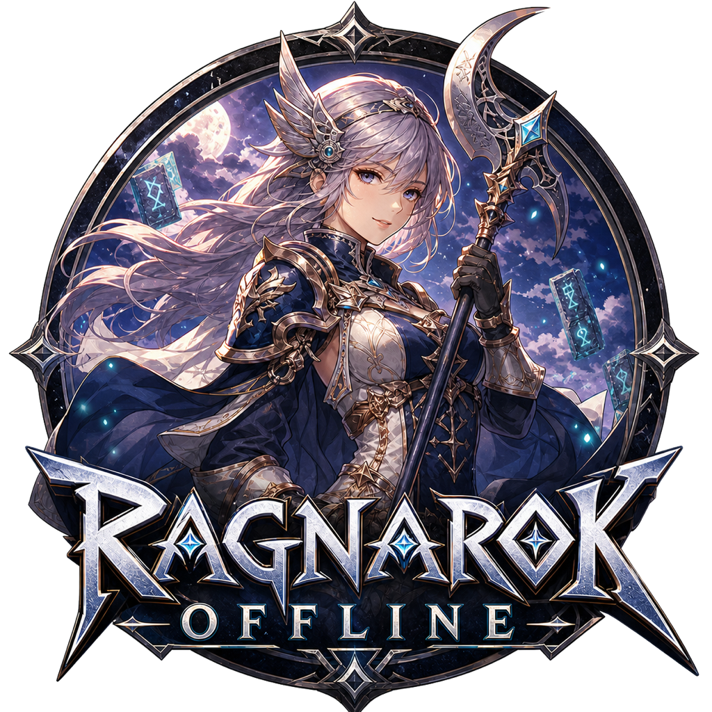
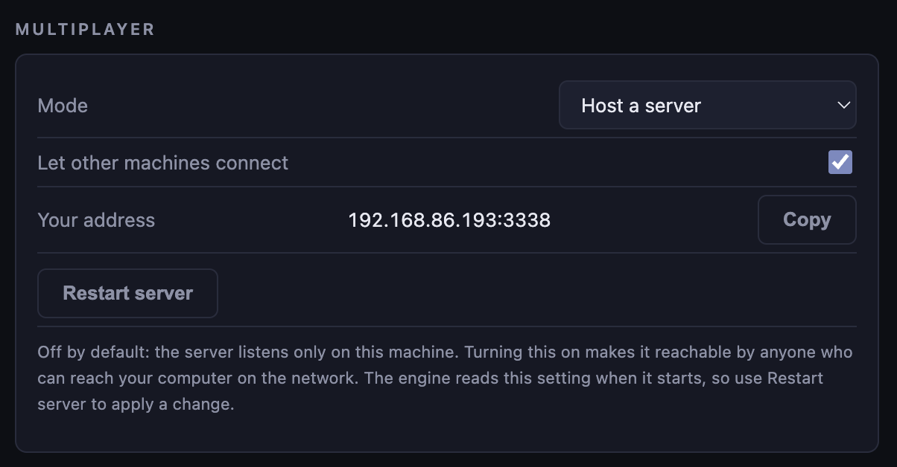
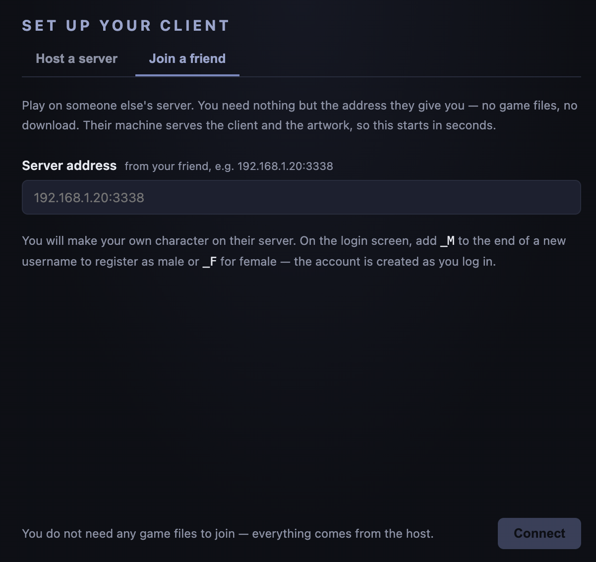
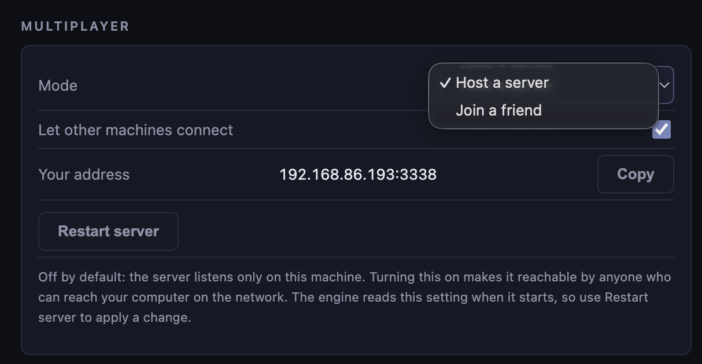
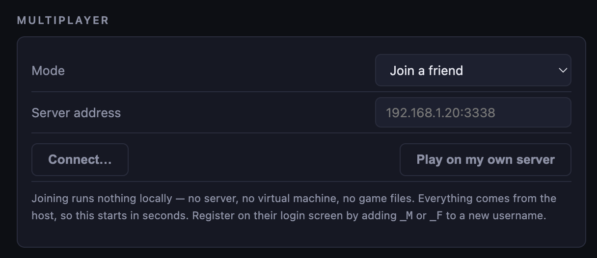
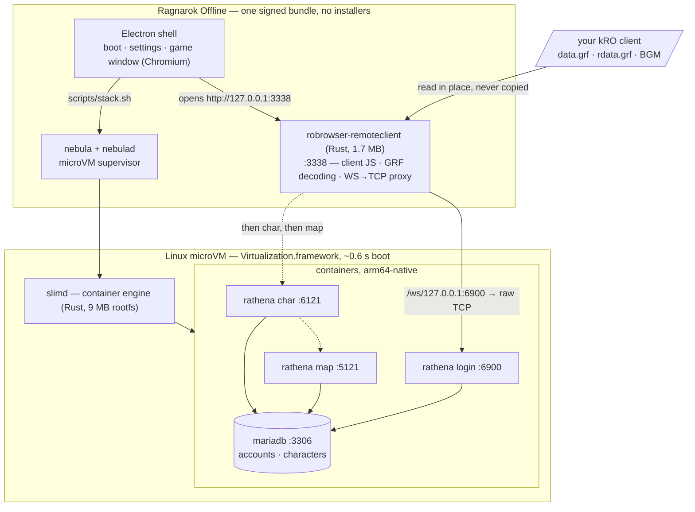
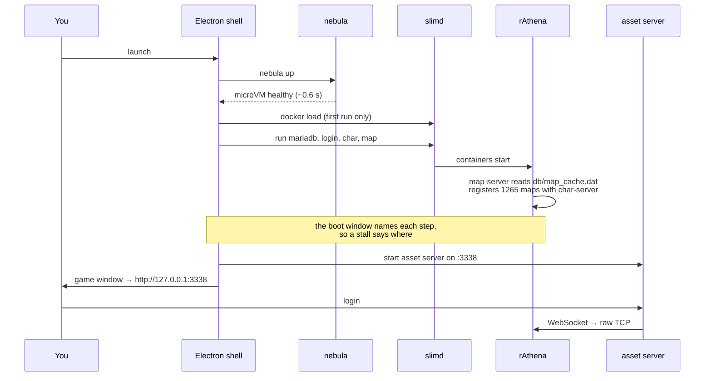

  

# Ragnarok Offline

Icon generated with GPT Image 2. No Gravity assets used.

A single, self-contained app that runs **Ragnarok Online offline** — server, client,
and game window in one icon. Double-click it and you are in Midgard after obtaining
the assets. macOS, Linux and Windows.

---

## Getting started

**1. Download a build.** Grab the latest release for your platform from the
[releases page](../../releases).

**2. Get a Ragnarok client.** You supply your own — see [License](#license). Put it
somewhere you can find again; unzipping a full client gives you a folder containing
`data.grf`, `rdata.grf` and a `BGM` folder, which is what the app looks for.

If you only want to join a friend who is hosting a server, see
[Hosting and playing with friends on your LAN](#hosting-and-playing-with-friends-on-your-lan)
— you do not need the assets at all.

**3. Open the app and point it at that folder.** The setup screen has a folder
picker: choose the folder you unzipped and it finds the rest. Then it starts the
server and drops you at the login screen.

Log in with **`ragnarok`** / **`ragnarok`** — the account is created for you on
first run — and make a character.

First launch takes a few minutes: it unpacks the runtime, boots the microVM, loads
the container images and initialises the database. The window names each step as it
goes, so you can see where it is. Every launch after that is seconds.

---

## Hosting and playing with friends on your LAN

Everyone on the same wifi can play together on one person's machine. Only the
host needs the game files.

### If you are hosting

**1. Go to Settings, tick "Let other machines connect", and restart the server.**
The engine reads this when it starts, so the *Restart server* button is what
applies it. Off by default, the server listens only on your own machine.

**2. Copy the address next to *Your address* and send it to your friends.** It is
the one they type in, and it only works for people who can already reach your
computer on the network. The first time you turn this on, your machine will
likely ask you to approve local network access — say yes, or nobody can connect.

**3. Keep the app running.** You are the server: when you quit, everyone's session
ends. Characters live on your machine too, so they stay with you rather than with
their owners.

### If you are joining

Joining a friend's server does not require you to download assets. On the setup
screen, just click **Join a friend** and enter the address that your friend sent.

The host serves the client and the artwork, so joining starts in seconds instead
of the few minutes a first run takes. You make your own character on their
server: on the login screen, add `_M` or `_F` to the end of a new username and
that account is created as you log in.

### Switching between the two

The same app does both, and you can change your mind at any time. In Settings,
switch **Mode**:

  
  

Picking **Join a friend** asks for their address; **Play on my own server** takes
you back to hosting. Joining runs nothing locally — no server, no microVM — so
switching to it stops your stack, and switching back starts it again.

---

## Architecture

Under the hood it stitches together three existing projects:

| Piece | Project | Role |
|---|---|---|
| microVM orchestrator | **nebula** | Runs the Linux side of the stack in a fast, embedded microVM |
| game server | [**rAthena**](https://github.com/rathena/rathena) | The open-source RO server emulator (login / char / map) + MariaDB |
| game client | [**roBrowserLegacy**](https://github.com/MrAntares/roBrowserLegacy) + **RemoteClient** | WebGL RO client, GRF asset server, and TCP↔WebSocket proxy |

The short version: **rAthena and roBrowserLegacy run unmodified, inside Linux
containers, inside a microVM the app carries with it.** Nothing is ported. The hard
part of running an RO server on a Mac is not the server — it is that the server was
never meant to run on one. So we do not port it; we bring Linux. The same holds for
Windows, which is how one codebase covers three platforms.

The shell is **Electron**, so the same Chromium renders the client everywhere and
there is one renderer to test against rather than three.

Ports are published to `127.0.0.1` unless you turn on
[LAN hosting](#hosting-and-playing-with-friends-on-your-lan), which binds them to
your network interface instead. The GRFs stay wherever you keep them —
the app symlinks them into a server root and reads them where they lie, so a
3.5 GB client is never duplicated.

### What actually happens when you press play

### Why a microVM rather than a native build

rAthena officially targets Linux and Windows. macOS is not a supported platform
and Apple Silicon less so. Compiling it against Homebrew MariaDB works for some
people some of the time, which is precisely the fragility a shipped `.app`
cannot have.

So the server runs on the platform it is actually tested on, and we inherit
every upstream fix instead of maintaining a fork. The cost is a microVM, and
with nebula-slim that cost is small: a **9.4 MB** compressed guest rootfs
running `slimd` — a Rust container engine — rather than the ~130 MB of
dockerd + containerd + runc it replaces.

The same property is what makes this cross-platform. The Linux side does not
change between macOS, Windows and Linux; only the host-side VM integration does.

### What each piece is, and whose it is

| Piece | Origin | Role here |
|---|---|---|
| [rAthena](https://github.com/rathena/rathena) | upstream, GPL-3.0 | the server. Unmodified; built arch-native at image build time |
| [roBrowserLegacy](https://github.com/MrAntares/roBrowserLegacy) | upstream, GPL-3.0 | the client. Built from source with a few patches in `patches/` |
| RemoteClient | GPL-3.0 | Rust rewrite of roBrowserLegacy's Node asset server |

---

## English translation assets

kRO is Korean, and the translation comes from
[**ROenglishRE**](https://github.com/llchrisll/ROenglishRE). Its text tables ship
inside the app, so the game is in English out of the box with no extra step.

If you also have that project's supplementary art pack — `official_data.grf`, which
contains no text at all, only translated sprites and textures — put it in the same
folder as your other GRFs. The app picks it up automatically and gives it priority
over the Korean artwork, so UI chrome, signage and item icons come out in English
too.

---

## Advanced features

Backing up and restoring your characters, where the app keeps its data on each
platform, how much disk it uses, and how to reset an install to a fresh state:
**[docs/ADVANCED_FEATURES.md](docs/ADVANCED_FEATURES.md)**.

---

## License

| Component | License |
|---|---|
| Ragnarok Offline | GPL-3.0 |
| [rAthena](https://github.com/rathena/rathena) | GPL-3.0 |
| [roBrowserLegacy](https://github.com/MrAntares/roBrowserLegacy) | GPL-3.0 |
| [ROenglishRE](https://github.com/llchrisll/ROenglishRE) | free to distribute, use and modify (see its headers) |
| RemoteClient-Rust | GPL-3.0 |
| nebula | MIT |

Game assets are copyright of Gravity Co., Ltd. and are not bundled or shipped with
Ragnarok Offline.
