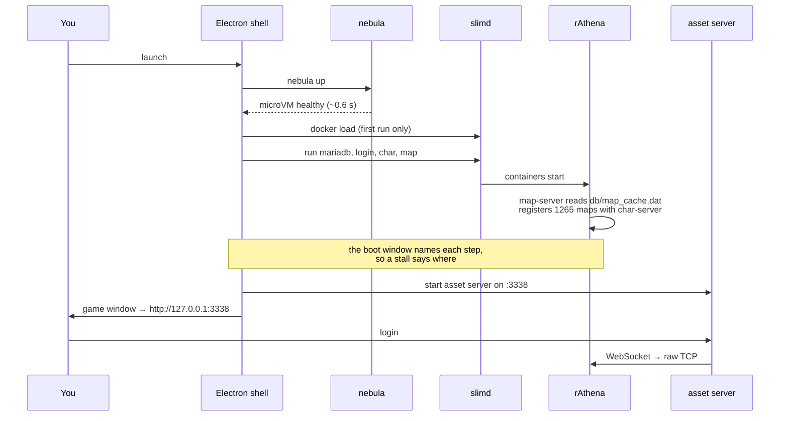

<p align="center">
  
</p>

# RagnarokMac

<sub>Icon generated with GPT Image 2. It is our own artwork — no Gravity assets are
used in it.</sub>

A single, self-contained macOS `.app` that runs **Ragnarok Online offline** — server,
client, and game window in one icon. Double-click it and you are in Midgard after obtaining
the assets.

Under the hood it stitches together three existing projects:

| Piece | Project | Role |
|---|---|---|
| microVM orchestrator | [**nebula**](https://github.com/Flux159/nebula) (`~/Projects/nebula`) | Runs the Linux side of the stack in a fast, embedded microVM on Virtualization.framework |
| game server | [**rAthena**](https://github.com/rathena/rathena) | The open-source RO server emulator (login / char / map / web) + MariaDB |
| game client | [**roBrowserLegacy**](https://github.com/MrAntares/roBrowserLegacy) + [**RemoteClient-JS**](https://github.com/FranciscoWallison/roBrowserLegacy-RemoteClient-JS) | WebGL RO client, GRF asset server, and TCP↔WebSocket proxy |

The app shell is **Electron**, so the same Chromium renders the client on macOS, Linux and Windows
share a toolchain and a signing/notarization pipeline.

---

## Goals

### 1. One artifact, zero setup

`RagnarokMac.app` is the entire product. First launch does the bootstrap (pull guest
images, build the rAthena image, initialize the database, index the GRFs) behind a
progress screen, and every launch after that is a warm start into the character
select. Uninstall is dragging the app to the Trash plus deleting one state directory.

### 2. Offline-first, single player

The default mode binds every service to `127.0.0.1`. No account server on the
internet, no ports open to the LAN, no login you have to remember — the app creates
and auto-logs-in a local account.

### 3. Tuneable like a single-player game

Rates that normally require editing `conf/battle/*.conf` and restarting the server are
first-class app settings with sliders:

- **Base / Job / Quest EXP rate**
- **Zeny (drop + reward) rate**
- **Item / Equipment / Card drop rates**
- **Renewal vs Pre-Renewal** mechanics
- **Max level, stat/skill point pools**
- **Instant-cast / no-death-penalty / autoloot** style quality-of-life toggles
- **@commands** (`@warp`, `@item`, `@job`) on or off

These write to `conf/import/battle_conf.txt` — rAthena's designated override file, so
upstream config stays pristine — and are applied with `@reloadbattleconf` where the
setting supports a live reload, or a supervised map-server restart where it does not.

### 4. Honest, visible state

A status panel shows what is actually running: VM up/down and its real host memory
footprint (Nebula's balloon means an idle stack should cost ~1 GiB, not 8), each of
the five rAthena services, the asset cache hit rate, and the current character count.
Nothing about the stack should be a black box the user cannot inspect or restart.

### 5. Play, then get out of the way

The game itself renders in a dedicated Electron window — fullscreen-capable, correct
retina scaling, no browser chrome, no address bar. It should feel like a native game,
not a web page in a frame.

### Later (explicitly not v1)

- **LAN mode.** Rebind services to `0.0.0.0`, flip `forceUseAddress` in the client
  config, and show a join URL + QR code. Friends on the same network open a browser
  and play — no client install on their side, which is the whole appeal of a
  browser-based client.
- **Invite a friend over the internet.** A tunnel (Tailscale / Cloudflare Tunnel /
  plain reverse proxy) in front of the same stack, with the client served over TLS.
  This needs a real look at authentication and abuse before it ships.
- **Content tooling.** In-app NPC/script editing, custom item and mob editors, world
  save/branch snapshots using Nebula's live memory snapshots (`vessels snapshot` +
  `branch`) so a server state can be forked and rolled back like a save file.
- **Nebula-slim.** If Nebula-slim's engine covers everything the stack needs, swap it
  in — it is ~32 MB versus ~140 MB+ for the full Go stack, and that is most of the
  difference between a 100 MB and a 300 MB download.

---

## Architecture

The short version: **rAthena and roBrowserLegacy run unmodified, inside Linux
containers, inside a microVM the app carries with it.** Nothing is ported. The
hard part of running an RO server on a Mac is not the server — it is that the
server was never meant to run on a Mac. So we do not make it; we bring Linux.


Ports are published to `127.0.0.1` only. The GRFs stay wherever you keep them —
the app symlinks them into a server root and reads them where they lie, so a
3.5 GB client is never duplicated.

### What actually happens when you press play



### Why a microVM rather than a native build

rAthena officially targets Linux and Windows. macOS is not a supported platform
and Apple Silicon less so. Compiling it against Homebrew MariaDB works for some
people some of the time, which is precisely the fragility a shipped `.app`
cannot have.

So the server runs on the platform it is actually tested on, and we inherit
every upstream fix instead of maintaining a fork. The cost is a microVM, and
with nebula-slim that cost is small: a **9.4 MB** compressed guest rootfs
running `slimd` — a Rust container engine — rather than the ~130 MB of
dockerd + containerd + runc it replaces.

The same property is what makes this cross-platform. The Linux side does not
change between macOS, Windows and Linux; only the host-side VM integration does.

### Why Electron rather than a system webview

The shell was Tauri, which uses whatever webview the OS provides: WKWebView on
macOS, WebKitGTK on Linux, WebView2 on Windows. That means three renderers and
three sets of rendering bugs, and we hit one — character sprites drew with two
heads on one body in character select, creation and the equipment window, on
WebKit only. The same client and server in Chrome were correct
([roBrowserLegacy #1350](https://github.com/MrAntares/roBrowserLegacy/issues/1350),
open, no cause found).

Electron carries its own Chromium, so there is one renderer to test against on
every platform. It costs about 70 MB of download; it buys not debugging three
browsers for the life of the project.

### Why the client runs in a WebView

roBrowserLegacy is a WebGL RO client, so the "game window" is a WKWebView
pointed at a local HTTP server. That server —
[a Rust rewrite](https://github.com/Flux159/roBrowserLegacyRemoteClient-Rust) of
upstream's Node RemoteClient — does three jobs on one port:

- serves the built roBrowser client,
- decodes sprites, maps and textures out of the GRF archives on demand,
  including the CP949 Korean filenames RO uses,
- proxies WebSocket connections to raw TCP, because a browser cannot open the
  TCP socket an RO client needs: `/ws/127.0.0.1:6900` → the login server.

One origin for everything means no CORS, one healthcheck, and one port to
rebind when this later grows a "join a friend's server" mode. The proxy's
allowlist (`WS_ALLOWED_TARGETS`) is the right primitive for that: it will only
ever dial hosts it has been told about.

Rewriting it in Rust replaced a 106 MB Node runtime and its dependency tree with
a single 1.7 MB static binary, which is most of why the download is what it is.

### What each piece is, and whose it is

| Piece | Origin | Role here |
|---|---|---|
| [rAthena](https://github.com/rathena/rathena) | upstream, GPL-3.0 | the server. Unmodified; built arm64-native at image build time |
| [roBrowserLegacy](https://github.com/MrAntares/roBrowserLegacy) | upstream, GPL-3.0 | the client. Built from source with a few patches in `patches/` |
| RemoteClient | ours, GPL-3.0 | Rust rewrite of upstream's Node asset server |
| [nebula](https://github.com/Flux159/nebula) | ours | microVM + container engine; the reason any of this is portable |
| Electron shell | ours | windows, settings, lifecycle, backup/restore, repair |
| Game assets | **yours** | Gravity's copyright. Never bundled, never redistributed |

---

## Repository layout (planned)

```
ragnarokmac/
├── electron/             app shell: windows, IPC, lifecycle, signing hook
├── src/                  Launcher + Settings UI
├── containers/
│   ├── rathena/          arm64 Dockerfile + build script for rAthena
│   └── remoteclient/     Dockerfile for RemoteClient-JS + roBrowserLegacy build
├── config/
│   ├── battle_conf.tmpl  Template rendered from the Settings values
│   └── Config.local.js.tmpl  roBrowser client config (address, port, packetver)
├── scripts/
│   ├── bootstrap.sh      Clone/pin upstream sources into vendor/
│   └── package.sh        Build, sign, notarize, staple, DMG
└── docs/
```

Upstreams are **pinned by commit** in `scripts/bootstrap.sh` and fetched at build
time. They are not vendored into git — rAthena alone is a large, fast-moving tree, and
tracking a pin is easier to reason about than a subtree merge.

---

## Game assets (the part that is on you)

RO client assets are copyrighted by Gravity Co., Ltd. They are **never** committed,
bundled, or redistributed with this app — `.gitignore` blocks GRFs, `BGM/`, `System/`,
and the client folder deliberately. The app points at a client directory you supply,
with a first-run screen that explains what is needed.

A working set is a full kRO client, plus the ROenglishRE overlay if you want
translated artwork. Where to obtain those is left to you: this project ships no
Gravity data and does not point at places to download it.

Unzipping a full client gives you `data.grf`, `rdata.grf`, `BGM/`, `System/` and
`AI/` in one folder, which is all the setup screen needs -- point it at that
folder and it finds the rest. The overlay, `official_data.grf`, is optional:
without it the game runs and the *text* is still English, because the ROenglishRE
tables ship inside the app. What the overlay adds is translated *art* -- UI
chrome, signage and item icons with Korean baked into the pixels.

### What a complete set looks like

Verified with `scripts/grfls.py` against the reference client:

| File | Size | Entries | Role |
|---|---|---|---|
| `data.grf` | 2.4 GB | 103,498 | **Base.** 854 maps, 7,269 models, 1,752 palettes, `luafiles514`, item/map name tables |
| `rdata.grf` | 931 MB | 55,012 | **Renewal overrides.** 605 files absent from `data.grf` + 135 that differ — the rest is duplicated |
| `official_data.grf` | 747 MB | 163,421 | *Overlay* from [llchrisll's ROenglishRE](https://github.com/llchrisll/ROenglishRE) docs. Costume/garment/effect sprites and other-region art (jRO/iRO/twRO event effects); 163,407 files absent from `data.grf`, colliding on only 14 — almost purely additive |
| `kro_data.grf` | 104 MB | 22,220 | Same source. **Skip it** — 22,147 of its 22,220 paths are already in `official_data.grf`, leaving 73 unique files |
| `BGM/` | 312 MB | 180 mp3 | Music, referenced by `data/mp3nametable.txt` |
| `System/` | — | — | `itemInfo*.lub`, `mapInfo*.lub`, quest lists, fonts |
| `AI/` | — | — | Homunculus/mercenary scripts |

### DATA.INI

**kRO does not ship one** — `Ragnarok.ini` and `RagnarokKR.ini` are encrypted launcher
config, not this. You write `resources/DATA.INI` yourself. **Lower index wins**, so
overlays go above the base:

```ini
[Data]
0=official_data.grf     ; overlay: costume/effect art (ROenglishRE docs)
1=rdata.grf             ; renewal overrides
2=data.grf              ; base: maps, models, palettes, lua
```

English text is *not* layered here — it comes in through `DATA_OVERRIDE_PATH`, which
outranks every GRF. See [English translation](#english-translation).

Run `scripts/grfls.py` on your files before wiring anything up:

```
$ scripts/grfls.py ~/Downloads/data.grf ~/Downloads/rdata.grf
```

It reads only the compressed file table (fast even on multi-GB archives) and reports
whether each archive is a playable base or a sprite overlay, plus a pairwise breakdown
of identical / overriding / unique paths so the load order can be chosen on real
numbers. A GRF with no `.rsw` entries fails at *map load*, not at startup, so this
check also runs on first launch — the app should say "this GRF has no maps" rather
than show a black screen.

### English translation (wired up)

kRO is Korean: `data/idnum2itemdisplaynametable.txt` and friends are CP949 Korean, and
there is **no `data/msgstringtable.txt`** at all — kRO ships
`data/luafiles514/lua files/msgstring_kr.lub`, which is not the file roBrowser reads.

The translation comes from [**ROenglishRE**](https://github.com/llchrisll/ROenglishRE).
Note that `official_data.grf` and `kro_data.grf` come from that project's docs site but
are **not** the translation — they contain zero text files, only `data/sprite` and
`data/texture`. They are the supplementary *art* packs. The translated text lives in
the repository's `Translation/` tree.

**We load the translation as loose files, not as a GRF.** `DATA_OVERRIDE_PATH` is
checked before any GRF (see the precedence chain below), so pointing it at
ROenglishRE's data folder overrides every Korean table without repacking a 2.4 GB
archive — and it can be re-pulled and diffed like the text it is:

```ini
DATA_OVERRIDE_PATH=../ROenglishRE/Translation/Renewal/data
```

`scripts/bootstrap.sh` sets this up. Two details cost real time and are worth
knowing if you touch it:

- **`System/` has to be merged, not swapped.** `ROenglishRE/SystemEN` covers the
  translated tables but not kRO's fonts and quest data. Bootstrap symlinks English
  first and backfills from kRO — while deliberately excluding kRO's
  `itemInfo*.lub`, because roBrowser's `getSystemAliases()` resolves `.lub` before
  `.lua` and the 2012 Korean table would otherwise shadow the English one.
- **`SystemEN/itemInfo.lua` is a stub, not the table.** It is a 3.8 KB loader that
  `require()`s and `dofile()`s the real 22.7 MB file. roBrowser runs a genuine Lua
  VM but mounts only the file it fetched, so those calls fail. Point
  `System/itemInfo.lua` at `SystemEN/LuaFiles514/itemInfo.lua` directly — it
  defines the global `tbl` that roBrowser's loader iterates.

The client config also needs `loadLua: true`, or roBrowser never reads the item,
robe, accessory and NPC name tables at all.

### Lookup precedence (verified in `clientController.js`)

For any asset request, RemoteClient-JS resolves in this order:

1. LRU memory cache
2. Loose files on disk next to the server root
3. `DATA_OVERRIDE_PATH` — **where the translation goes**
4. The GRF index — and within it, **the first GRF listed in `DATA.INI` wins**
   (`buildFileIndex()`: *"Only store first occurrence (first GRF has priority)"*)

So index `0` is the highest priority, not the lowest. An overlay placed *last* would be
shadowed by kRO's originals and do nothing. If you ever do ship the translation as a
GRF instead of loose files, it goes at index `0`.

### Other gaps

- **`System/itemInfo.lub`.** The live table is `System/itemInfo_true.lub`
  (2020-06-03); the `itemInfo.lub` at the client root is a 2012 leftover. Copy or
  symlink the right one into place — ROenglishRE ships a translated replacement, which
  is the one we actually want. Note it is compiled Lua 5.1 bytecode (`LuaQ` header),
  not source; confirm roBrowser's reader handles the compiled form before assuming
  item descriptions work.
- **Korean filenames.** Every asset path inside these GRFs is CP949-encoded
  (`data\texture\유저인터페이스\...`), and roBrowser requests them as Latin-1
  mojibake. RemoteClient-JS indexes both spellings and has an explicit mojibake
  fallback, which is a large part of why it was chosen over rolling our own asset
  server.

### Loose files

Anything not inside a GRF — `System/`, `BGM/`, `AI/` — is served from disk. Point
`DATA_OVERRIDE_PATH` at it, or place the folders next to `resources/`. The override
path is checked *after* local `data/` and *before* GRF lookup, which makes it the
right place for per-server tweaks that should not require repacking a 2.4 GB archive.

### Packet version

The reference client is `Ragexe.exe` 2020-06-03 / `RagexeRE.exe` 2020-04-10. Pin
rAthena's `--enable-packetver` and roBrowser's `packetver:` to a value in that era
(**20200401** is the value roBrowser's own docs use and is well-trodden in rAthena).
Upstream's AIO compose defaults to `20250618`, which is far newer than these assets —
do not inherit it blindly.

## Running it

```bash
scripts/bootstrap.sh ~/Downloads     # clone + build upstreams, link GRFs, build rAthena
scripts/stack.sh up                  # MariaDB + login/char/map in the microVM
scripts/release.sh --dmg ~/Downloads  # builds, signs and verifies the .dmg
```

Then open `RagnarokMac.app`, press **Start server**, then **Play**.

`scripts/stack.sh status|down|logs <service>` covers the rest. The app drives
the same script, so anything you can do in the launcher you can do in a terminal.

## Status

Working end to end on Apple Silicon (macOS 26.5, M-series):

| Piece | State |
|---|---|
| rAthena arm64 image | built, 224 MB runtime image, packetver 20200401 |
| MariaDB + schema | 63 tables imported on first boot |
| login / char / map | all three up, map connected to char, char to login |
| GRF asset serving | **1,012,440 files** indexed across 3 GRFs in 2.2 s |
| WebSocket proxy | browser-shaped `CA_LOGIN` returns `AC_ACCEPT_LOGIN` |
| login → char handshake | verified over the advertised address |
| English client | `msgstringtable.txt` + 22.7 MB English item table served over the Korean originals |
| Electron shell | `RagnarokMac.app` + DMG, launcher UI live and driving the shell commands |

### Two Nebula bugs, found and fixed

Getting the game socket through a published port surfaced two real defects in
Nebula's `crates/nebulad/src/net.rs`. Both are fixed on the `fix/port-forward-churn`
branch of that repo:

1. **A failed container listing looked like an empty one.**
   `list_containers(...).unwrap_or_default()` meant one hiccup in the Docker query
   dropped *every* port forward and DNS name, rebuilding them on the next 2-second
   tick. HTTP requests never noticed; persistent connections died. The tell was
   every port vanishing on one timestamp, including containers nobody had touched:

   ```
   01:06:37  port forward removed port=5121
   01:06:37  port forward removed port=3201   <- unrelated, up for months
   01:06:37  port forward removed port=6900
   01:06:39  port forward added   port=5121
   ```

2. **`-p 127.0.0.1:6900:6900` produced a forward that could never work.**
   That spec makes dockerd bind the *guest's* loopback, but the macOS path always
   dialled the guest's NAT address, where nothing listens. The host connection was
   accepted and dropped ~1.0 s later with no diagnostic — reproducible with a bare
   `nc` echo container. `list_containers` now records each mapping's `HostIp`, and
   loopback-scoped ports route through the agent's vsock TCP proxy, which already
   falls back to the guest's `127.0.0.1`. Wildcard publishes keep the direct-dial
   fast path.

Verified after the fix: a connection through `-p 127.0.0.1:9999:9999` survives 45 s
of continuous traffic where it previously reset at 1.0 s every time, and the
wildcard path is unchanged.

**What that bought us.** Publishing works normally again, so the stack is plain
loopback end to end: `char_ip`/`map_ip` are simply `127.0.0.1`, the proxy allowlist
is static, and `scripts/stack.sh` lost its guest-IP discovery entirely (104 → 92
lines). Nothing binds outside the host's loopback.

### Still to do

- Containerise the asset server so the `.app` no longer needs Node on the host.
- Code signing and notarization.
- Auto-create the local account instead of seeding it by hand.

## License

**GPL-3.0.** Not a choice so much as a consequence: rAthena, roBrowserLegacy and
RemoteClient-JS are all GPL-3.0, and RagnarokMac combines and distributes them, so
the combined work is GPL-3.0 as well. In practice that means anyone you hand a
build to is entitled to the corresponding source, and a closed-source fork is not
an option while it bundles these projects.

| Component | License |
|---|---|
| RagnarokMac | GPL-3.0 |
| [rAthena](https://github.com/rathena/rathena) | GPL-3.0 |
| [roBrowserLegacy](https://github.com/MrAntares/roBrowserLegacy) | GPL-3.0 |
| [RemoteClient-JS](https://github.com/FranciscoWallison/roBrowserLegacy-RemoteClient-JS) | GPL-3.0 |
| [ROenglishRE](https://github.com/llchrisll/ROenglishRE) | free to distribute, use and modify (see its headers) |
| [Nebula](https://github.com/Flux159/nebula) | MIT |

Game assets are a separate matter entirely and are covered by none of the above:
the GRFs are copyright Gravity Co., Ltd., there is no licence to redistribute them,
and RagnarokMac never bundles or ships them. You point the app at your own client.
