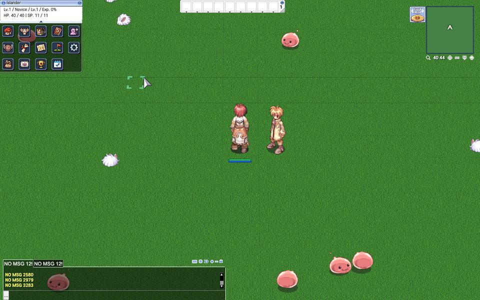

# custom-map

A map that is not in anybody's GRF. Its ground, its monsters and its NPC all
come out of this folder, and the app builds everything the server needs from
the geometry the client is already being given.



Get there with the [island-ferry](../island-ferry) mod, or — as a GM — with
`@warp ro_isle 40 40`.

## What to look at first

The fact that there is nothing here to configure.

A custom map needs **three** things on the server side, and this is the part
that is worth knowing because two of them are invisible:

1. **A `map:` line in the map config.** The map server builds its list of maps
   from `map:` directives — `conf/maps_athena.conf` is twelve hundred of them.
   A map that is never named there is simply not in the list, and the server
   says *nothing at all* about it. This is the one that wastes an afternoon.
2. **An entry in `db/import/map_index.txt`.** Gives the map the number the
   login, char and map servers pass between them. Missing, and the map is
   dropped at load with only a "maps removed" count to say so.
3. **An entry in `db/import/map_cache.dat`.** rAthena's map server never reads
   a `.gat` at runtime; it reads a prebuilt cache and refuses any map that is
   not in one, however correctly the map is registered elsewhere. Upstream
   builds this with a separate `mapcache` tool that links against the whole
   server and reads geometry out of a GRF.

The app does all three for you. On every start it scans each enabled mod's
`data/` for `.gat` files, decodes them, writes a `map_cache.dat` and a
`map_index.txt` into the `db/import` tree it mounts, and adds the `map:` lines
to the generated `map_conf.txt` (`stack/src/mapcache.rs` and
`stack/src/mods.rs`). **Drop the geometry in `data/` and the server side is
done.** No `mapcache` tool, no Docker rebuild, no image change.

You will see it in the startup output:

```
mods: custom-map
mod maps: ro_isle
```

and in the map server log the total map count goes up by one.

## The files

```
data/ro_isle.gat                       walkability     server and client
data/ro_isle.gnd                       the ground mesh client only
data/ro_isle.rsw                       the world        both (water level only)
data/texture/ro_isle/ground.bmp        what it looks like
data/texture/<interface>/map/ro_isle.bmp   the minimap picture
```

`.gat` is one 20-byte record per walkable cell. `.gnd` is the mesh, at half the
`.gat`'s resolution — a 80 × 80 walkable map is a 40 × 40 `.gnd`. `.rsw` names
the other two and holds the water level, the lighting and the list of objects.

Without the minimap bitmap the client asks once, gets a 404, and shows an empty
frame. Harmless, and the first thing anyone notices.

## Making your own

```
scripts/mkmap.py my_isle --out path/to/my-mod/data --cells 40
```

That writes all five files: a flat, walled, walkable square with a generated
grass texture and a minimap. It is a floor to stand on, not a landscape — for
real terrain you want one of the community map editors, and then you copy its
`.gat`/`.gnd`/`.rsw` into `data/` exactly like these.

Two limits worth knowing before you name anything:

- **Map names are at most 11 characters.** rAthena stores `MAP_NAME_LENGTH`
  bytes and truncates silently at three separate layers before anything
  complains.
- **The lightmap is not a brightness value.** Each `.gnd` lightmap cell is 64
  bytes of shadow followed by 64 RGB triples of *additive* coloured light.
  Filling the whole cell with `0xff` — the obvious thing — adds full white
  light to every pixel and renders the map as a flat white sheet with the
  texture washed out of it. `mkmap.py` gets this right; a hand-rolled
  generator usually does not, the first time.

## Applying it

Both halves. `db/`-side registration happens when the **server** starts; the
geometry is linked into the asset tree when the **app** starts. A new map
therefore wants the app restarted, not just the server.
