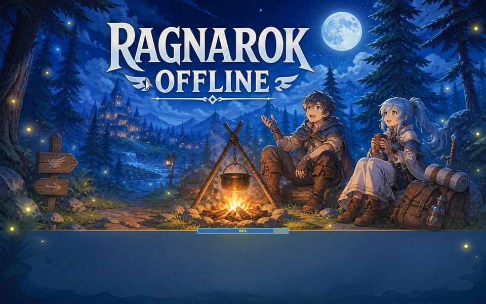

# loading-screens

Ten loading screens, one `data/` layer, and the answer to a question worth
having: **the randomising is already there.**



## What to look at first

`UI/Background.js` in the client. Every time a map loads it calls
`Background.setLoading()`, which does this:

```js
const index = Math.floor(Math.random() * _loading.length);
Background.setImage(_loading[index] || 'loading01.jpg', ...);
```

and `_loading` is a fixed list of ten names, built in `Background.init()`:

```
loading01.jpg  loading02.jpg  ...  loading10.jpg
```

all under `data/texture/À¯ÀúÀÎÅÍÆäÀ̽º/`. So nothing has to be added to make
loading screens rotate — they already do. What a mod supplies is *which ten*.

That list is not configurable. `Background.init()` accepts an array (it is meant
to come from `clientinfo.xml`), but every call site passes nothing, so the ten
default names are what the client asks for on every map change. Naming a
loading screen anything else means it is never drawn.

This mod ships all ten, and that is deliberate. Shipping five and leaving the
rest looks fine right up until the client rolls a six, and then you get one of
the client's own — which for a 2022 kRO archive means a 2004 convenience-store
promotion in Korean, complete with a Gravity copyright line. Half a set of
loading screens reads as a bug, not as a partial mod.

If you only want to replace some of them, that works too: name the ones you
have `loading01.jpg` upward and the rest stay the client's.

The files are JPEG saved under a `.jpg` name, and each is about 190 KB at
1024 × 768. (The login screen's tiles are JPEG saved under a `.bmp` name, for
the same reason: browsers decode by content, not by extension.)

## Sizing

The client stretches each image to the whole window with
`background-size: 100% 100%`, so any aspect ratio works and none is safe: a
16:9 window will squash a 4:3 image. These are 1024 × 768, which is what the
stock ones are, and they keep a quiet band across the bottom third because the
progress bar is drawn over it.

## Applying it

Client assets are linked when the app starts, so this needs the **app**
restarted rather than the server. The asset server caches everything it has
served, so a changed image that appears not to take is usually a cached one.
